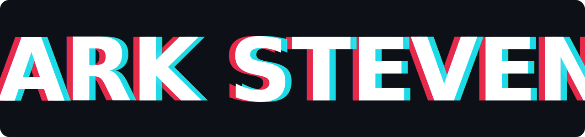
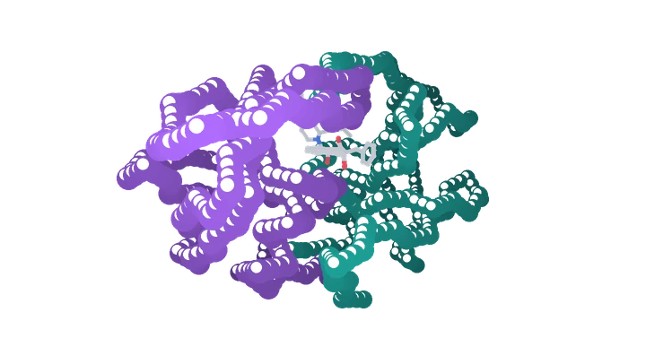
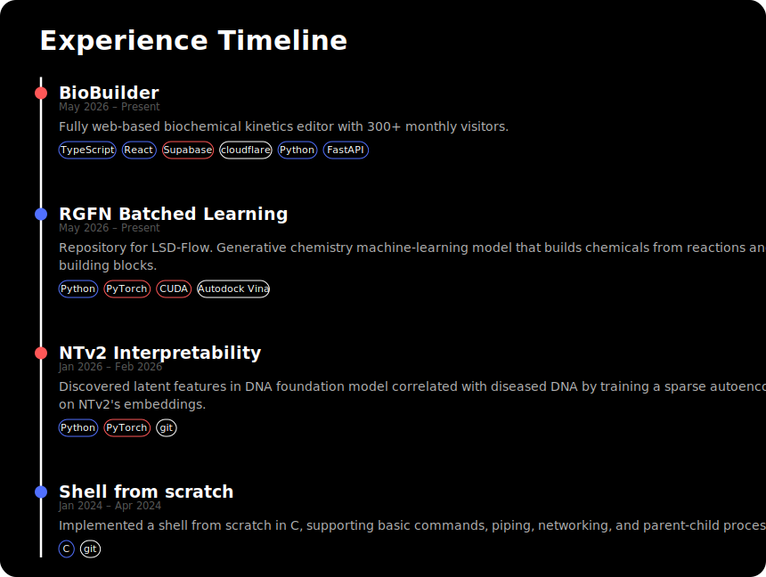

<!-- Name Banner -->

  

<!-- HERO: live 3D render of HIV-1 protease -->

  

<!-- ABOUT  ·  edit this blurb freely -->

  <b>Computational biologist &amp; full-stack developer</b> based at UC Irvine, working at
  the interface of molecular biology, drug discovery, and software. 
  I build things that span molecular dynamics, structure prediction, and the
  web apps &amp; pipelines that make them usable! I also founded <b>BioBuilder</b>.

<!-- SOCIAL / CONTACT -->

  
  
  <!-- Add your own — just uncomment and fill in the URL:
  
  
  -->

<!-- TYPING INTRO -->

  

---

<h2 align="center">🛠️ &nbsp;Tech Stack</h2>

<b>💻 &nbsp;Languages &amp; Web</b>

  
  
  
  
  
  
  
  

<b>🤖 &nbsp;ML / AI &amp; Data</b>

  
  
  
  
  
  
  
  
  
  
  

<b>🧬 &nbsp;Computational Biology</b>

  
  
  
  
  
  
  
  
  
  
  
  
  
  

<b>🏗️ &nbsp;Infrastructure &amp; Tooling</b>

  
  
  
  
  
  
  
  
  
  
  
  
  
  
  
  

---

<!-- Experience Timeline · generated from projects.json + skills.json by tools/build_readme.py -->
<!-- PROJECTS:START -->

  

<!-- PROJECTS:END -->
